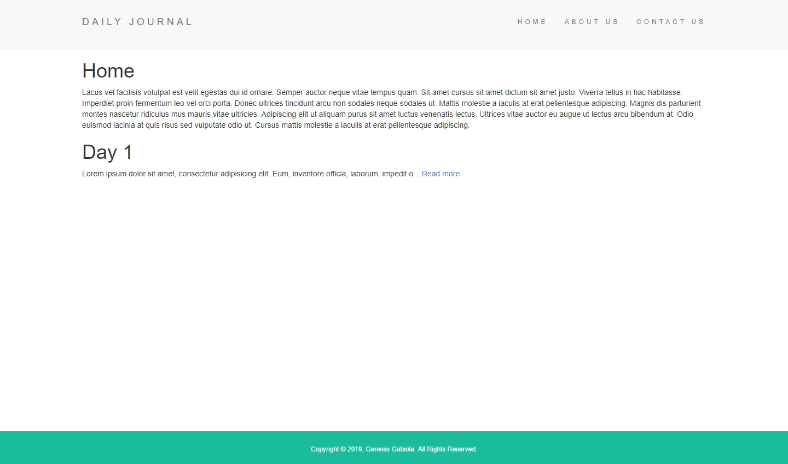

# Blog

A simple and temporary blog for my website.

## Built with:
- HTML5
- CSS3
- Bootstrap
- Node
- Express
- EJS

<!--  -->

<!-- Visit the [live preview](https://genesisgabiola.github.io/blog). -->

## Installation

Clone the repository, change to the directory, and use npm to install dependencies.

```sh
$ git clone hhttps://github.com/genesisgabiola/blog.git
$ cd blog
$ npm install
```

## Usage

- The project can be run with npm
- Open your browser and launch the website at [localhost:3000](https://localhost:3000).

```sh
$ npm start
```

## Future Improvements:

- [ ] Improve the UI and UX.
- [ ] Add some more content.
- [ ] Add a database to store the items.

## How to Contribute?

- Open an [issue](https://github.com/genesisgabiola/blog/issues).
- Contact me on [twitter](http://twitter.com/genesisgabiola).

Any queries, suggestions, issues to report or critics are welcome :) You can freely connect to me.